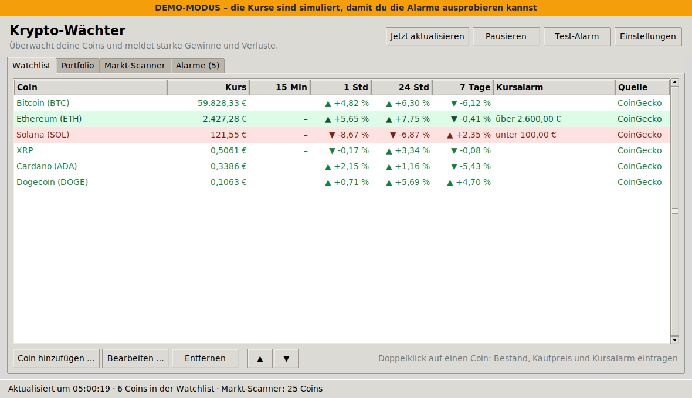
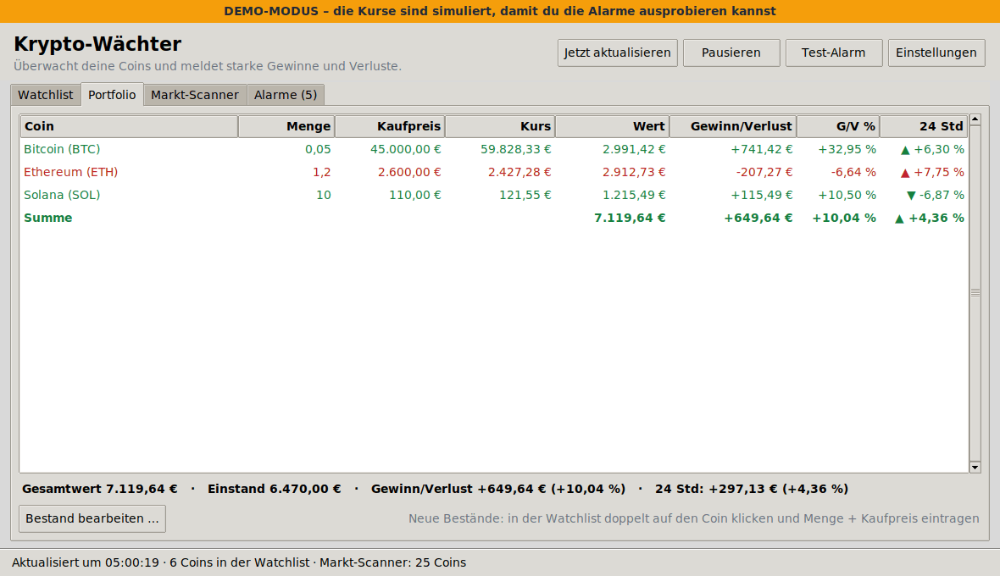
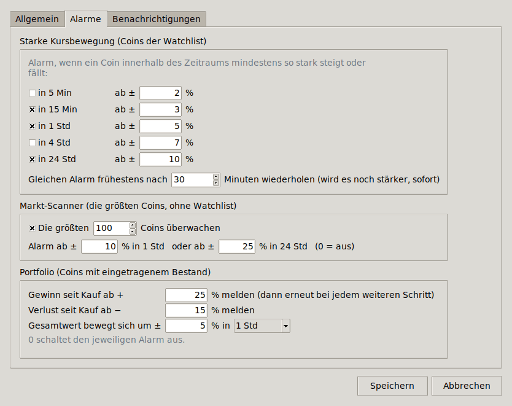

# Krypto-Wächter

Ein Programm für **Windows 11**, das Kryptowährungen überwacht und dich benachrichtigt,
sobald sich etwas stark bewegt: starke Kursgewinne und -verluste, erreichte Kursziele und
Gewinn/Verlust deines eigenen Portfolios.



## Was das Programm kann

- **Watchlist**: aktuelle Kurse (standardmäßig in Euro) mit der Veränderung über 15 Minuten,
  1 Stunde, 24 Stunden und 7 Tage. Die Daten kommen von **CoinGecko** (Durchschnitt über viele
  Börsen) oder direkt von der Börse **Binance**.
- **Alarm bei starken Bewegungen**, z. B. ±3 % in 15 Minuten, ±5 % in 1 Stunde oder ±10 % in
  24 Stunden – alle Schwellen sind einstellbar.
- **Portfolio**: Wenn du Menge und Kaufpreis einträgst, siehst du Wert, Gewinn/Verlust in € und %
  und bekommst eine Meldung, z. B. ab +25 % Gewinn, ab −15 % Verlust oder wenn sich der
  Gesamtwert innerhalb einer Stunde um 5 % bewegt.
- **Kursalarme** pro Coin: Meldung, wenn der Kurs über oder unter einen bestimmten Preis geht.
- **Markt-Scanner**: überwacht die 100 größten Coins und meldet Ausreißer, z. B. +10 % in einer
  Stunde – auch bei Coins, die nicht in deiner Watchlist stehen.
- **Benachrichtigungen**: Windows-Meldung unten rechts, Ton, blinkendes Taskleistensymbol und
  optional **Telegram** aufs Handy.
- Alle Alarme landen zusätzlich in `alarme.csv` (lässt sich mit Excel öffnen).

Du brauchst **kein Börsenkonto, keine Anmeldung und keinen API-Schlüssel**. Das Programm liest
nur öffentliche Kurse; es kann weder kaufen noch verkaufen und kennt keine Zugangsdaten.



## Installation

### Variante A: fertige .exe (ohne Python)

Bei jeder Änderung an diesem Ordner baut GitHub automatisch eine `Krypto-Waechter.exe`:

1. Auf GitHub im Repository oben auf **Actions** klicken und links den Workflow
   **„Krypto-Wächter für Windows bauen“** wählen.
2. Den neuesten Lauf mit grünem Haken öffnen und unten bei **Artifacts** auf
   **Krypto-Waechter-Windows** klicken. Du lädst dann eine ZIP-Datei herunter, dafür musst du bei
   GitHub angemeldet sein.
3. ZIP entpacken und `Krypto-Waechter.exe` in einen festen Ordner legen, z. B.
   `Dokumente\Krypto-Waechter`. Dann doppelklicken.
4. Falls Windows „Der Computer wurde durch Windows geschützt“ meldet: **Weitere Informationen →
   Trotzdem ausführen**. Das erscheint, weil die Datei nicht digital signiert ist.

### Variante B: mit Python

1. Python von <https://www.python.org/downloads/> installieren. Beim Setup
   **„Add python.exe to PATH“** anhaken.
2. Den Ordner `krypto-waechter` herunterladen (auf GitHub **Code → Download ZIP**) und entpacken.
3. Doppelklick auf **`start.bat`** oder direkt auf `Krypto-Waechter.pyw`.

Zusatzpakete sind nicht nötig. Das Programm nutzt nur Bestandteile, die bei Python für Windows
dabei sind.

### Eigene .exe bauen

Mit installiertem Python auf **`exe_bauen.bat`** doppelklicken. Die fertige Datei liegt danach in
`dist\Krypto-Waechter.exe`.

## Erste Schritte

1. **Ausprobieren ohne echte Kurse**: *Hilfe → Demo-Modus starten*. Es öffnet sich ein zweites
   Fenster mit simulierten Kursen, in dem nach wenigen Sekunden die ersten Alarme ausgelöst werden.
   Der Demo-Modus hat eigene Einstellungen und verändert deine Watchlist nicht.
2. **Coins hinzufügen**: *Coin hinzufügen …* → Namen oder Kürzel suchen (z. B. „bitcoin“,
   „SOL“) → Treffer auswählen → *Speichern*.
3. **Bestand eintragen**: In der Watchlist doppelt auf einen Coin klicken und Menge und Kaufpreis je
   Coin eintragen. Danach erscheint er im Reiter *Portfolio*. Du kannst Zahlen so eingeben, wie du
   es gewohnt bist, z. B. `0,05` oder `58.000`.
4. **Benachrichtigung testen**: Auf *Test-Alarm* klicken. Unten rechts sollte eine
   Windows-Meldung erscheinen.
5. **Schwellen anpassen**: *Einstellungen → Alarme*.

## So funktionieren die Alarme

| Alarm | Voreinstellung | Erklärung |
|---|---|---|
| Starke Kursbewegung | ±3 % in 15 Min, ±5 % in 1 Std, ±10 % in 24 Std | für alle Coins der Watchlist; 5 Min und 4 Std lassen sich zuschalten |
| Kursalarm | aus | pro Coin: „steigt über“ und/oder „fällt unter“ einen Preis |
| Gewinn seit Kauf | ab +25 % | danach erneut bei +50 %, +75 % … |
| Verlust seit Kauf | ab −15 % | danach erneut bei −30 %, −45 % … |
| Portfolio-Gesamtwert | ±5 % in 1 Std | Summe aller eingetragenen Bestände |
| Markt-Scanner | Top 100, ±10 % in 1 Std oder ±25 % in 24 Std | Coins der Watchlist sind ausgenommen |

Damit du nicht mit Meldungen überschüttet wirst, gelten diese Regeln:

- Derselbe Alarm kommt erst wieder, wenn sich die Lage beruhigt hat **und** mindestens
  30 Minuten vergangen sind (einstellbar).
- Wird eine Bewegung noch stärker (z. B. von −5 % auf −10 % in einer Stunde), kommt **sofort**
  eine neue Meldung.
- Lösen viele Coins gleichzeitig aus, zum Beispiel bei einem Crash, gibt es eine Sammelmeldung.

Die Werte für 1 Std, 24 Std und 7 Tage liefert die Datenquelle direkt. Kürzere Zeiträume
(5 und 15 Minuten) und 4 Stunden berechnet das Programm aus den eigenen Abrufen. Diese Werte
erscheinen deshalb erst, wenn das Programm entsprechend lange läuft. Nach dem Standby wird nicht
fälschlich Alarm geschlagen.



## Alarme aufs Handy (Telegram, optional)

1. In Telegram den Kontakt **@BotFather** öffnen, `/newbot` senden und den Anweisungen folgen.
   Am Ende bekommst du einen **Bot-Token**, z. B. `123456789:ABCdef…`.
2. Deinem neuen Bot in Telegram eine beliebige Nachricht schicken, z. B. „Hallo“.
3. Im Programm *Einstellungen → Benachrichtigungen*: Token eintragen, auf **Chat-ID ermitteln**
   klicken, dann *Alarme zusätzlich per Telegram senden* anhaken und mit **Test-Nachricht senden**
   prüfen.

## Mit Windows starten

*Einstellungen → Allgemein → Mit Windows starten*. Das Programm startet dann nach der Anmeldung
minimiert in der Taskleiste. Beim Schließen des Fensters endet die Überwachung. Zum Weiterlaufen
im Hintergrund das Fenster nur minimieren.

## Wo liegen meine Daten?

Im Ordner `%APPDATA%\KryptoWaechter`, erreichbar über *Datei → Ordner mit Einstellungen und
Protokollen öffnen*:

- `config.json`: Watchlist, Bestände und Einstellungen
- `alarme.csv`: alle bisherigen Alarme
- `krypto-waechter.log`: technisches Protokoll für die Fehlersuche

## Fehlerbehebung

- **Keine Windows-Meldungen**: In Windows unter *Einstellungen → System → Benachrichtigungen*
  prüfen, ob Benachrichtigungen eingeschaltet sind, „Nicht stören“ aus ist und „Krypto-Wächter“
  erlaubt ist. Hilft das nicht, im Programm *Einstellungen → Benachrichtigungen →
  Kompatibilitätsmodus* einschalten und erneut *Test-Alarm* drücken.
- **„CoinGecko: Zu viele Anfragen (HTTP 429)“**: Ohne API-Key erlaubt CoinGecko nur wenige Abrufe
  pro Minute. Du kannst das Intervall erhöhen (z. B. 120 Sekunden) oder einen kostenlosen
  **Demo-API-Key** auf coingecko.com erstellen und unter *Einstellungen → Allgemein* eintragen.
  Das Programm pausiert bei diesem Fehler automatisch kurz.
- **„Binance: HTTP 451“**: Binance ist in manchen Ländern nicht erreichbar. Nutze dann CoinGecko
  als Quelle.
- **Virenscanner meldet die .exe**: Das ist ein bekannter Fehlalarm bei Programmen, die mit
  PyInstaller gebaut werden. Alternativ kannst du Variante B (Python) verwenden.
- **„Krypto-Wächter läuft bereits“**: Das Programm läuft nur einmal gleichzeitig, damit keine
  doppelten Meldungen kommen. Das Fenster findest du in der Taskleiste.

## Für Entwickler

```
krypto-waechter/
├── Krypto-Waechter.pyw     Startdatei (Doppelklick)
├── start.bat / exe_bauen.bat
├── krypto_waechter/
│   ├── app.py              Start, Befehlszeile, Selbsttest
│   ├── gui.py              Fenster und Dialoge (Tkinter)
│   ├── console.py          Konsolenmodus
│   ├── monitor.py          Abruf im Hintergrund, Anfrage-Limits
│   ├── engine.py           Kursverlauf, Alarmregeln, Portfolio
│   ├── providers.py        CoinGecko, Binance, Demo-Kurse
│   ├── notifier.py         Windows-Meldungen, Ton, Telegram
│   ├── winutils.py         Autostart, Taskleiste, Einzelinstanz
│   ├── config.py           Einstellungen (config.json)
│   ├── formatting.py       Zahlen im deutschen Format
│   └── net.py              HTTP (nur Standardbibliothek)
└── tests/
```

- Tests: `python -m unittest discover -s tests`. Die Oberflächentests laufen nur mit Bildschirm.
- Konsolenmodus: `python Krypto-Waechter.pyw --konsole` (zusätzlich `--demo`, `--einmal`,
  `--intervall 30` möglich)
- Der GitHub-Workflow `.github/workflows/krypto-waechter.yml` führt die Tests unter Windows aus,
  baut die .exe und prüft sie mit `--selbsttest`.

## Hinweis

Keine Anlageberatung. Kursdaten ohne Gewähr (Quellen: CoinGecko, Binance). Kryptowährungen sind
sehr schwankungsanfällig, und Alarme können verspätet oder gar nicht ankommen, etwa wenn der PC
schläft oder keine Internetverbindung besteht.
